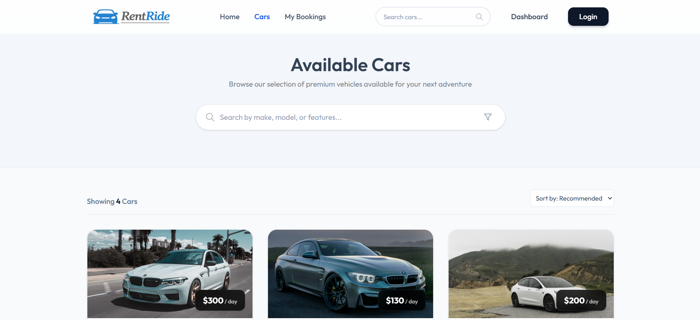
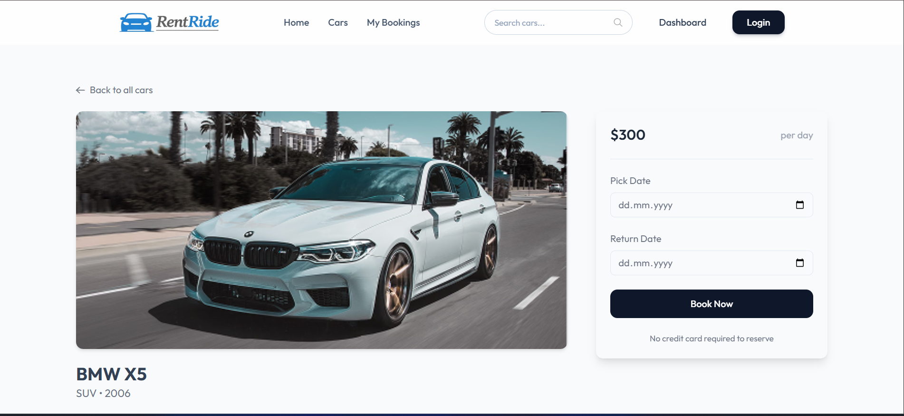

# React + Vite

This template provides a minimal setup to get React working in Vite with HMR and some ESLint rules.

Currently, two official plugins are available:

- [@vitejs/plugin-react](https://github.com/vitejs/vite-plugin-react/blob/main/packages/plugin-react) uses [Babel](https://babeljs.io/) (or [oxc](https://oxc.rs) when used in [rolldown-vite](https://vite.dev/guide/rolldown)) for Fast Refresh
- [@vitejs/plugin-react-swc](https://github.com/vitejs/vite-plugin-react/blob/main/packages/plugin-react-swc) uses [SWC](https://swc.rs/) for Fast Refresh

## React Compiler

The React Compiler is not enabled on this template because of its impact on dev & build performances. To add it, see [this documentation](https://react.dev/learn/react-compiler/installation).

## Expanding the ESLint configuration

If you are developing a production application, we recommend using TypeScript with type-aware lint rules enabled. Check out the [TS template](https://github.com/vitejs/vite/tree/main/packages/create-vite/template-react-ts) for information on how to integrate TypeScript and [`typescript-eslint`](https://typescript-eslint.io) in your project.

# 🚗 RentRide – Car Rental Web App

✨ A modern and responsive **Car Rental UI** built with **React.js, JavaScript, HTML & CSS**.
This project allows users to explore cars, view details, and simulate booking with a smooth and elegant interface.

---

## 🎯 Key Features

✔️ Browse available cars with clean UI
✔️ Car detail page with pricing
✔️ Booking section with date selection
✔️ Responsive design (Mobile + Desktop)
✔️ Search functionality
✔️ Smooth UI/UX inspired layout

---

## 🖼️ Screenshots

<p align="center">
  
</p>

### 🏠 Car Listing Page

# 🚗 RentRide – Car Rental Web App

✨ A modern and responsive **Car Rental UI** built with **React.js, JavaScript, HTML & CSS**.
This project allows users to explore cars, view details, and simulate booking with a smooth and elegant interface.

---

## 🔥 Live Preview

🚀 *(Add your deployed link here – Vercel/Netlify)*

---

## 🎯 Key Features

✔️ Browse available cars with clean UI
✔️ Car detail page with pricing
✔️ Booking section with date selection
✔️ Responsive design (Mobile + Desktop)
✔️ Search functionality
✔️ Smooth UI/UX inspired layout

---

## 🖼️ Screenshots

### 🚘 Car Details & Booking Page

<p align="center">
  
</p>

---

## 🎨 UI Highlights

💡 Premium card design with price tags
💡 Clean navigation bar (Home, Cars, Bookings)
💡 Search bar for better UX
💡 Modern booking panel
💡 Minimal & professional color palette

---

## 🛠️ Tech Stack

* ⚛️ React.js
* 📜 JavaScript (ES6+)
* 🌐 HTML5
* 🎨 CSS3

---

## 📂 Folder Structure

```
src/
 ├── components/
 ├── pages/
 ├── assets/
 ├── App.js
 └── index.js
```

---

## ⚙️ Installation & Setup

```bash
# Clone repository
git clone https://github.com/your-username/rentride.git

# Go to project folder
cd rentride

# Install dependencies
npm install

# Run project
npm start
```

---

## 🚀 Future Enhancements

🔹 Add backend (Node.js + MongoDB)
🔹 User authentication system
🔹 Real booking functionality
🔹 Payment gateway integration
🔹 Car filtering (price, brand, type)

---

## 👨‍💻 Author

**Rohit Mahato**

---

## 🌟 Support

If you like this project, give it a ⭐ on GitHub and share it!

---


### 🚘 Car Details & Booking Page


---

## 🎨 UI Highlights

💡 Premium card design with price tags
💡 Clean navigation bar (Home, Cars, Bookings)
💡 Search bar for better UX
💡 Modern booking panel
💡 Minimal & professional color palette

---

## 🛠️ Tech Stack

* ⚛️ React.js
* 📜 JavaScript (ES6+)
* 🌐 HTML5
* 🎨 CSS3

---

## 📂 Folder Structure

```
src/
 ├── components/
 ├── pages/
 ├── assets/
 ├── App.js
 └── index.js
```

---

## ⚙️ Installation & Setup

```bash
# Clone repository
git clone https://github.com/your-username/rentride.git

# Go to project folder
cd rentride

# Install dependencies
npm install

# Run project
npm start
```

---

## 🚀 Future Enhancements

🔹 Add backend (Node.js + MongoDB)
🔹 User authentication system
🔹 Real booking functionality
🔹 Payment gateway integration
🔹 Car filtering (price, brand, type)

---

## 👨‍💻 Author

**Rohit Mahato**

---

## 🌟 Support

If you like this project, give it a ⭐ on GitHub and share it!
